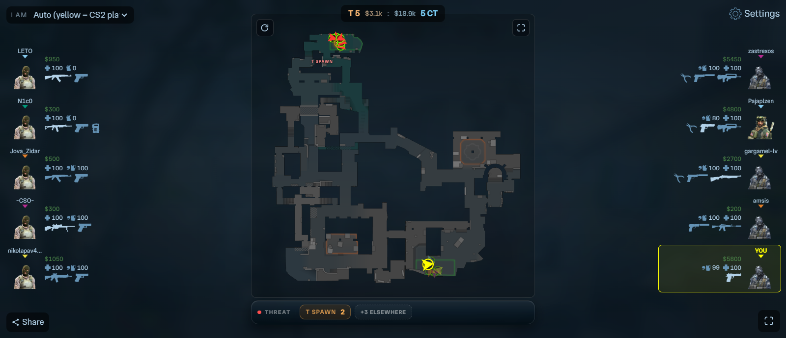

# CS2Situation

A live radar for Counter-Strike 2, in your browser.

Shows every player on the map — where they are, which way they're looking, who has the bomb — plus your team panels, enemy warnings, and area threat.

> **Study project.** Built to learn how CS2 stores its data in memory. It only **reads** game memory — nothing is written, injected, or hooked.



---

## How it works

Three pieces. The game is the source, the C++ program is the reader, the browser is the display.

```
   cs2.exe  (the game running)
      │
      │  reads memory (read-only)
      ↓
   usermode.exe  ── C++ program
      │  walks the entity list every 100 ms,
      │  turns what it finds into JSON
      │  sends it over a WebSocket
      ↓
   webapp/ws  ── tiny Node bridge
      │  passes the data to every open browser
      ↓
   Browser  ── React app draws the radar
```

**Step by step:**

1. **Read.** The C++ program opens the game process for reading and walks its 1024 entity slots, 10 times a second.
2. **Understand.** Each entity's class name is checked — a player controller becomes a player, a C4 becomes bomb state.
3. **Package.** Results are collected into one small JSON object per tick.
4. **Send.** That JSON goes out over a WebSocket on port 22006.
5. **Draw.** A small Node bridge fans it out to every open browser tab, and React renders the map.

The C++ side never touches the game beyond reading. All the visuals live in the browser, so you can change the UI without recompiling anything in C++.

**Keyboard shortcuts** — `F` fullscreen · `M` map only · `R` rotate map · `ESC` stop following · click any dot to follow that player

---

## Features

**Players**
- Arrow per player, pointing where they look
- HP ring on each dot — green, yellow, red
- Wounded players pulse
- Dead players dim and freeze at their last position
- Dim teammates so enemies stand out
- Click a dot or a roster card to follow them

**Enemies**
- Enemy dots red, teammates in team colors, you in yellow
- **⚠ AIMING AT YOU** warning when an enemy has you in their crosshair
- Beep when an enemy gets close
- **"Enemy spotted — Long"** popup when an enemy enters a named area
- **Threat bar** under the map: one chip per area, redder with more enemies, `CLEAR` when the map is empty

**Bomb**
- Orange badge on the bomb carrier
- Dropped C4 — yellow pulsing marker
- Planted C4 — red flashing marker
- Bomb timer with fuse and defuse countdown
- Marker turns green once defused

**Map**
- Auto-fit zoom that crops empty space
- Rotate and mirror
- Opacity slider
- 17 maps

**Team panels**
- T on the left, CT on the right
- Character portrait, name, money, health, armor
- Weapon icons with the active one highlighted
- Click a name to open their Steam profile

**Sharing**
- Share button lists LAN addresses so a phone or tablet on the same WiFi can open the radar
- Each viewer picks their own player, so friend/enemy is correct for everyone
- Warning banner if the data feed stops

---

## Install and run

**You need:** [Node.js](https://nodejs.org/), [Visual Studio Community](https://visualstudio.microsoft.com/vs/community/), [vcpkg](https://vcpkg.io/), and CS2.

### 1. Start the web app

```bash
cd webapp
npm install
npm run dev
```

This starts the bridge and the dev server. Open **http://localhost:5173**.

### 2. Build and run the C++ program

Open `usermode/cs2situation.sln`, press `Ctrl+Shift+B`, then run the built binary.

**Run it as administrator** — it needs permission to open the game process for reading.

### 3. Play

The page shows "waiting for data" until the program is running and a match is loaded.

### Config

`usermode/config.json`:

```json
{
    "m_ip": "localhost",
    "m_secret": "cs2situation-local-dev-secret"
}
```

Keep `m_ip` as `localhost` for local use. Set it to your LAN address to serve other devices — the bridge listens on port `22006`.

**Change `m_secret` before you expose the bridge to a network.** It must match what the bridge expects, and the value above is published in this repo, so treat it as a placeholder. The program prints a warning at startup while the default is still in use.

---

## Project structure

```
cs2situation/
├── usermode/          C++ program that reads the game
│   └── src/
│       ├── core/      resolves field offsets from the game
│       ├── sdk/       entity and handle wrappers
│       ├── features/  the actual scan: players, bomb
│       └── utils/     memory access, pattern scanning
└── webapp/            the browser radar
    ├── ws/            WebSocket bridge (port 22006)
    ├── public/data/   per-map radar images and coordinates
    └── src/           React components
```

---

## Notes

A few things worth knowing if you read the code:

- **Offsets are resolved at startup.** CS2 names its fields but doesn't hardcode where they sit, so `src/core/schema.hpp` hashes each field name and looks the address up once.
- **Bomb carrier detection reads inventories.** The obvious way — matching the C4's owner handle to each player — fails intermittently for reasons that are hard to see. Instead it walks each player's weapons; if a C4 is in there, they have it.
- **Dead players keep their portrait.** A dead pawn has no scene node, so the model name comes back empty. The program remembers name → model in a local cache file so portraits survive a round change, and warns if that file can't be written.
- **Crash safety.** Game services can be null during menus and round transitions, so every pointer is checked before it's read.
- **Performance.** Scanning the game binary for patterns is expensive, so it's throttled to once every 5 seconds instead of every tick — that alone was causing game stutter.
- **Named areas cover 11 of the 17 maps.** On `cs_agency`, `de_cache`, `de_golden`, `de_grail`, `de_palacio`, and `de_train` the radar works but has no area names or threat chips.
- Reading another process's memory needs administrator rights and can be blocked by anti-cheat software.

---

## Disclaimer

This is an educational project for understanding game engine internals. It reads memory only. Using it outside a private or practice environment may violate the terms of service of the game.

---